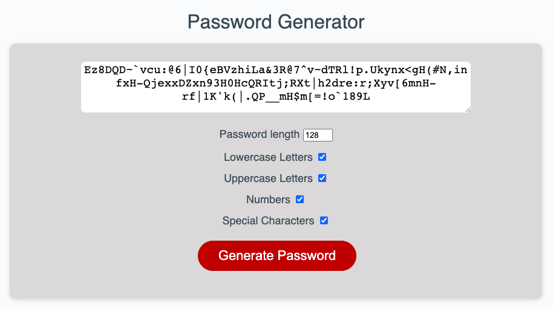

# Password Generator

## Description
A password generator that does the following"

The password criteria is determined through check boxes so the user can change the settings at any time before the password is generated. It also give instant verification through the use of check marks and the number.

The length of the password is between 8 and 128 characters. If the user enters a value that is not within that range an alert informs the user of the range and stops the app.

The character types are: lowercase, uppercase, numeric, and/or special characters.

A password is generated that matches the selected criteria when the button "Generate Password" is clicked.

The password is then displayed on the page.

